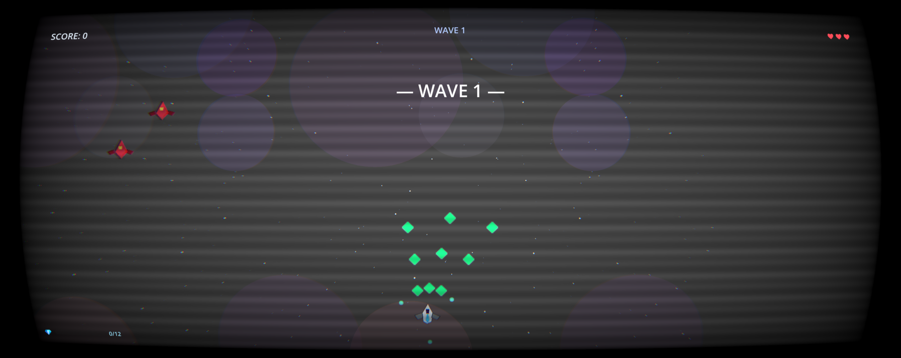
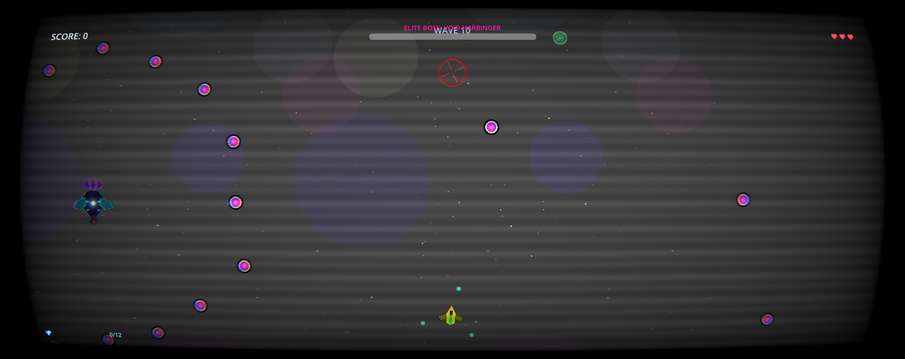
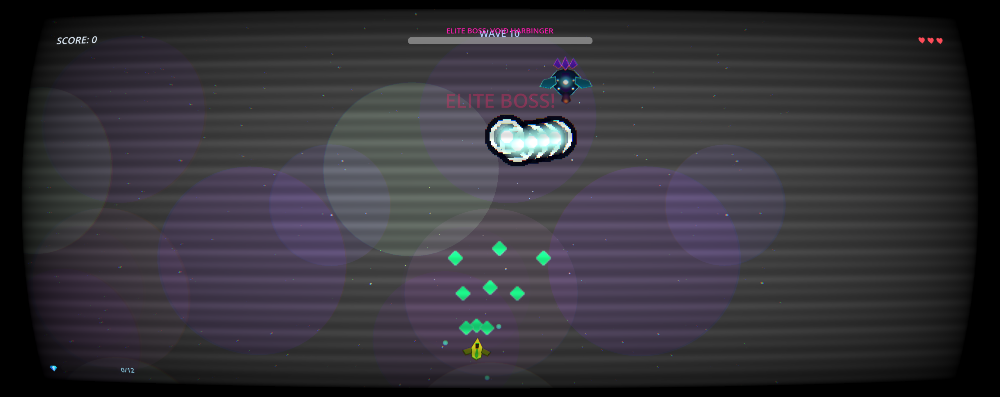

# Farinuff Flight

A premium single-purchase native 3D arcade shooter built in Godot 4. Farinuff Flight centers on fast survival play, drift-heavy ship handling, boost-reflection combat, transformative run builds, and an authored Wave-20 Expedition that opens into optional Endless mastery.

Gameplay now runs entirely through native 3D actors, with five boss hulls, destructible boss weapon pods, all 13 elite abilities, modular ship upgrades, and pooled 3D effects. The old 2D combat runtime has been retired. Completion hardening is covered by native contract checks and a live Godot 4.6.3 scene run; target-hardware visual and performance acceptance remains a release-validation task. Changes and validation are recorded in [the transition log](docs/3d-migration-checklist.md).

## Gameplay Mechanics

Farinuff Flight uses a taught finite Expedition followed by optional Endless play. Standard enemies spawn from the screen edges, drop XP orbs on defeat, and increase pressure as the wave count rises. XP orbs fill the wave meter, restore lives after enough collection, and advance the run toward tougher enemy mixes.

Combat uses held auto-fire with free aim support. The ship can aim with mouse movement or controller right stick input, while keyboard movement keeps the ship inside the visible playfield. Boosting adds a short high-speed dash, post-boost drift, native particle bursts, projectile deflection, and chain potential after multiple reflected shots.

Power-ups appear during active waves and can be collected by contact or shot pickup. Current temporary effects include bullet scale increases, rapid fire, shield, spread shot, magnet, and nuke. These stack with run upgrades to create different weapon profiles across a session.

Progression adds permanent run choices at milestone moments. Every fifth cleared wave grants stat allocation points for fire rate, health, and movement speed. Native boss encounters occur every 5 waves. Elite rewards offer up to three unowned upgrades, including homing fire, twin cannons, permanent spread, rear fire, shield bursts, overclock, permanent magnet, hull plating, afterburners, and a drone escort. Unlocked blueprints add orbitals, piercing, and explosive rounds. The cards preview the selected hull with its existing modules and the proposed addition; acquired modules also appear on the native craft. Temporary spread and permanent spread combine into a five-shot central fan.

The first launch opens Flight School, a replayable five-page briefing covering movement, boost reflection, the orb/life economy, build decisions, and the Wave-20 target. Failure uses a try-again flow before final game over. Remaining try-again stocks can continue a run, clear immediate pressure, and return the ship with temporary invincibility. Final game over records score, high score, and highest wave reached.

Runs also earn salvage — a persistent currency banked from boss kills and an end-of-run bonus based on score and waves cleared. Salvage spends in the Hangar on the title screen: tiered ship systems (starting lives, speed, fire rate, extra try-again stocks), elite blueprints that add Orbital Array, Piercing Rounds, and Explosive Rounds to the elite upgrade pool, ship variants, and challenge modifiers.

Before each run, the launch bay offers a loadout choice: pick an unlocked ship variant (the balanced Swallowtail, the fast-but-fragile Interceptor, or the slow-but-tough Bulwark) and toggle any owned challenge modifiers — faster spawns, armored enemies, no power-ups, and more — each paying a percentage bonus on all salvage earned that run. The game-over screen itemizes where the run's salvage came from.

## Controls

- Movement: `WASD` or `Arrow Keys`, or gamepad left stick
- Shoot: hold `Space`, gamepad `A` / right trigger
- Boost: `Shift`, gamepad `B` / left trigger
- Pause: `Escape`
- Free aim: mouse movement or gamepad right stick
- Alt controls (Settings toggle): shoot with `Left Mouse Button`, boost with `Space`

## Tech Stack

- Engine: Godot 4.6 project format with Forward+ rendering; the menu and retry flow launch the native 3D runtime; 2D HUD and backdrop remain
- Language: GDScript 2.0 with typed scripts across gameplay systems
- Architecture: scene-based composition with reusable player, enemy, bullet, power-up, HUD, menu, and popup scenes
- Global state: autoload singletons for `GameManager`, `MetaProgression`, `SignalBus`, and `SaveManager`
- Event flow: signal-driven score, combo, life, orb meter, wave, boss, allocation, elite upgrade, settings, and game-over updates
- Rendering: procedural starfield and background layers, shader-driven CRT overlay, distortion pass, screen shake, tweens, and generated visual effects
- Persistence: saved settings and high score through the save manager
- Build target: exported Windows desktop build included with the repository

## Native assets and checks

The completion asset source is `tools/generate_native_completion_assets.py`. It generates six original low-poly GLBs in `assets/models/native/`: an orbital sentinel, orbital/piercing/explosive modules, a shock ring, and a muzzle flare. Existing authored boss hulls and butterfly variants supply the rest of the fleet.

Run `python3 tools/check_native_transition.py` for file-only resource and GLB checks. CI retains autoload/VFX smoke coverage and adds `tests/native_completion_smoke.tscn` for native upgrades, projectile recycling, and boss variants. Static checks do not establish engine parsing, visual quality, combat balance, or frame rate. The gameplay screenshots above predate the completion changes.
