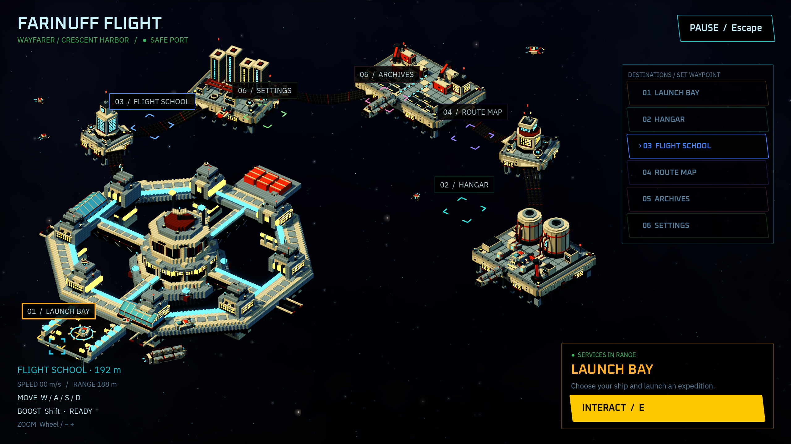
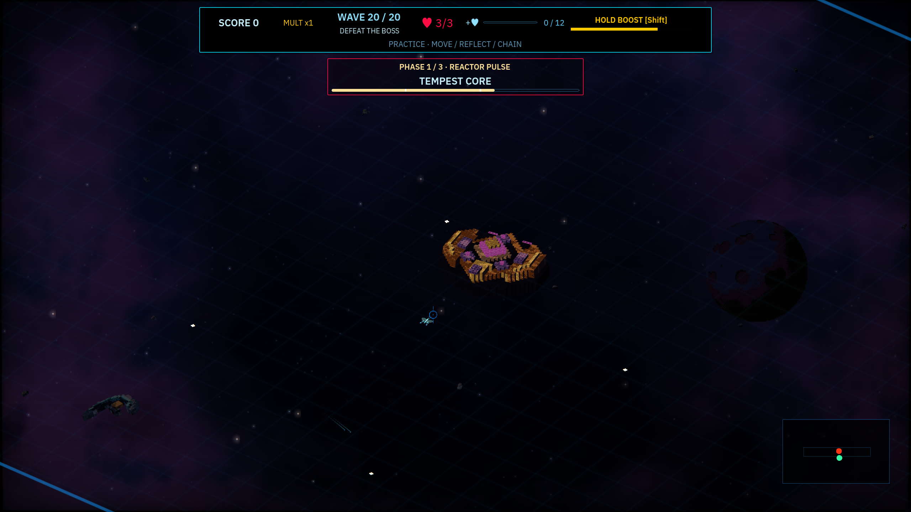

# Farinuff Flight

A native 3D space arcade shooter built in **Godot 4.6.3**. Fly a butterfly-shaped craft, reflect enemy fire with boost, and assemble a ship that changes as your run unfolds.

[](https://github.com/DiscM/Farinuff-Flight/actions/workflows/smoke_tests.yml)



## Fly, reflect, rebuild

- **Boost-reflection combat.** Hold boost to burn through the meter, steer through incoming fire, and return projectiles for extra damage. Reflections replenish boost and open follow-up chains.
- **A 20-wave Expedition.** Collect XP orbs, survive increasingly capable enemy formations, and defeat four milestone bosses. Finish at Tempest Core or continue into Endless, where Void Harbinger awaits.
- **Builds that change your craft.** Combine temporary power-ups with 13 elite abilities: homing fire, twin cannons, orbitals, piercing rounds, explosive rounds, a drone escort, and more. Installed modules appear on the ship.
- **Progress between runs.** Bank salvage to unlock ship variants, permanent systems, blueprints, and challenge modifiers.
- **A home port you can fly through.** Visit Launch Bay, Hangar, Flight School, Route Map, Archives, and Settings at Wayfarer / Crescent Harbor.

Start with **Flight School** to learn movement, reflection, collection, and build choices. Then choose a ship at Launch Bay and start an Expedition. Defeat offers a continue while stocks remain; finishing a run records your score, wave, and salvage earnings.

Settings and permanent progression are saved locally. Active runs are session-scoped and cannot be resumed after quitting.

## Run the game

The project is in active development. Open it from source with the pinned **Godot 4.6.3** editor and Forward+ rendering:

```sh
git clone https://github.com/DiscM/Farinuff-Flight.git
cd Farinuff-Flight
```

Import `project.godot` in Godot, let asset imports finish, and press **F6** with `scenes/home_base.tscn` open, or **F5** to run the project. The game starts at Crescent Harbor.

Windows release candidates are built through [GitHub Actions](https://github.com/DiscM/Farinuff-Flight/actions/workflows/release_candidate.yml). See the [developer guide](docs/development.md) for exports, automated checks, and release validation.

## Controls

Default bindings; combat actions can be remapped in Settings.

| Action | Keyboard / mouse | Gamepad |
| --- | --- | --- |
| Move | WASD / arrow keys | Left stick |
| Aim | Mouse | Right stick |
| Fire | Hold Space | A / right trigger |
| Boost / reflect | Hold Shift | B / left trigger |
| Pause | Escape | Start |
| Change camera angle | C | Left bumper |
| Rotate camera 90° | V | Right bumper |
| Use a home-port service | E, while nearby | A, while nearby |
| Home-port zoom | Mouse wheel / − / + | Shoulder buttons |

The alternate-controls setting uses left mouse button to fire and Space to boost. Movement and aiming follow the selected camera view.

## Combat preview



Captured from the current Godot 4.6.3 build. The combat image shows Tempest Core firing during boss practice; UI and balance continue to evolve.

## Explore the project

| Resource | What it covers |
| --- | --- |
| [Development and validation](docs/development.md) | Architecture, smoke tests, asset checks, and Windows exports |
| [Home port](docs/wayfarer-home-port.md) | Crescent Harbor assets and authoring |
| [Gameplay refinement](docs/gameplay-refinement.md) | Combat and progression design |
| [Production ledger](docs/production-implementation.md) | Release work and remaining acceptance evidence |
| [Third-party notices](THIRD_PARTY_NOTICES.md) | Asset and dependency attribution |
