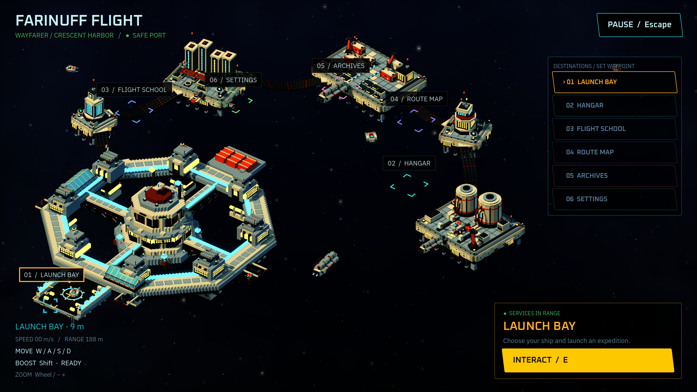

# Wayfarer Crescent Harbor — Blender recreation

An editable 3D recreation of the selected asymmetric Crescent Harbor spacecraft mockup. The scene contains Wayfarer's open habitation ring and tiered port-control tower; five role-specific relay islands; reinforced four-strand cable bundles; greenhouse planting, cabin windows, roof machinery and docking equipment; and a fleet of spacecraft with sealed pods, thrusters and docking hardware.

The islands provide traffic signaling, power distribution, cargo logistics, approach control, and refueling/repair. Their uneven sizes and spacing leave an open arrival basin. Docked ships have their engines off; moving craft and maintenance drones follow through-traffic routes. Radar, scanner and robotic-arm parts remain separate editable objects.

Traffic follows nine approach and departure routes through the basin, over the industrial relays and around the outer station. Every moving craft enters and leaves the fixed camera once per 20-second cycle. Return turns use separate altitude lanes outside the frame, and ships face their direction of travel. The parked fleet remains fixed to its berths.

The cleanup revision seats promenade panels on the octagonal deck, connects rooftop fins and apron curbs, supports the greenhouse frames and dish pedestals, and removes twisted tube faces. Parked ships have continuous pressure couplers or contact saddles. The core's 47,039 occupied voxels form one face-connected volume, and all 76 promenade panels sit within the deck footprint.

Six station assemblies now make small independent position and attitude corrections. Each cable bundle has 24 articulated sleeves and two hull-mounted sockets; docked craft inherit their station's motion. Mounted navigation lamps pulse, two coolant rotors turn, and the existing underside nozzles give short correction bursts. These are presentation loops rather than an orbital simulation.

## Files

- `../source/wayfarer_crescent.blend`: editable Blender 5.2.1 source, with materials, camera, lights and animation.
- `../meshes/wayfarer_crescent.glb`: complete placed composition, excluding presentation lights, camera and starfield.
- Other `../meshes/*.glb`: local-origin station, island and spacecraft modules with reusable child machinery animation.
- `../textures/*.png`: original pixel-plating maps. Images are also packed in the blend and GLBs.
- `../build_manifest.json`: output hashes, reference, object groups, triangles, export sizes and animation records.
- `../../../../design/home-base/blender-crescent/`: actual Blender render previews.
- `../../../../design/home-base/blender-crescent/crescent-motion.mp4`: a 20-second EEVEE animation review at 960×540, 8 fps; the Blender source retains its 24 fps timeline.

The full composition keeps the original source scale. Blender uses Z up; GLBs export Y up. Scene animation runs at 24 fps, frames 1–481 (20 seconds), with GLB transform samples every two frames to preserve traffic-route clearance. Module exports clear world-space traffic transforms while retaining child mechanisms; parked spacecraft are excluded from station modules. Camera framing and backdrop are presentation-only.

Play `orbital_correction` for the stations and all cable sleeves together. `navigation_lights`, `correction_thrusters`, `cooling_rotors`, traffic and scanner clips can play alongside it. Lamp pulses use emissive lens geometry scaling inside fixed housings, so they survive standard GLB transform animation without animated-material extensions.

## Rebuild

From the repository root, use a fresh Blender process:

```sh
/Applications/Blender.app/Contents/MacOS/Blender --background --factory-startup --python tools/build_crescent_harbor_blender.py -- --preview
python3 tools/check_crescent_harbor.py --report assets/models/wayfarer_crescent/docs/validation.json
/Applications/Blender.app/Contents/MacOS/Blender --background --factory-startup --python-exit-code 1 --python tools/crescent_harbor/verify_blender.py
/Applications/Blender.app/Contents/MacOS/Blender --background --factory-startup --python-exit-code 1 --python tools/crescent_harbor/check_traffic.py -- --substeps 4 --report assets/models/wayfarer_crescent/docs/traffic-verification.json
/Applications/Blender.app/Contents/MacOS/Blender --background --factory-startup --python-exit-code 1 --python tools/crescent_harbor/verify_traffic_camera.py
```

Optional close-up renders, without modifying the saved source:

```sh
/Applications/Blender.app/Contents/MacOS/Blender --background --factory-startup --python tools/crescent_harbor/render_details.py
/Applications/Blender.app/Contents/MacOS/Blender --background --factory-startup --python tools/crescent_harbor/render_overview.py
/Applications/Blender.app/Contents/MacOS/Blender --background --factory-startup --python-exit-code 1 --python tools/crescent_harbor/render_motion.py -- --render
```

The builder writes only this delivery and its preview directory. It never overwrites the existing `home_base` assets. The source script supports `--draft` for a faster preview and `--skip-export` for authoring iterations. Start in a fresh scene rather than executing the builder twice into a scene that already has the named composition.

`tools/crescent_harbor/export_delivery.py` exports an already checked source without rebuilding or resaving it. This keeps source hashes consistent between collision checks, exports and movies.

## Game integration

The production home port now instantiates `meshes/wayfarer_crescent.glb` as the complete composition. `systems/crescent_harbor_visuals.gd` preserves all fourteen ships and combines all sixteen imported clips into one private synchronized twenty-second loop. It removes conflicting rest-pose filler tracks inserted by Godot while keeping the imported source animations and shared materials unchanged. The nine through-traffic routes retain their authored transforms; the previous circular support fleet is not used.

`systems/crescent_harbor_layout.gd` applies 2× scale to the composition, places the gameplay plane at source height 11.5, and supplies padded station clearance and flight bounds. Six proximity services are mapped to distinct physical berths by `systems/home_port_sections.gd`. Pausing, entering a local service, or enabling Reduced Motion freezes environmental animation. The source-scale Blender camera remains a presentation camera; the game's camera follows the pilot and can zoom independently.

See `docs/wayfarer-home-port.md` at the repository root for controls, local service behavior and runtime checks. Integration changes runtime scripts and delivery metadata only; the authored GLBs, textures and Blender source retain their recorded hashes.



The gameplay capture uses Godot 4.6.3 Forward+ on Metal at 2560×1440. Station and fleet shadows remain enabled; the 130 cable and 24 correction-exhaust meshes omit shadow casting. Live interaction opened the local Launch Bay and Hangar and returned to flight with Escape. A roughly 43 fps observation during animation on an A18 Pro is a single snapshot, not a benchmark.

## Verification boundary

Validation checks GLB geometry, bounds, UVs, materials, image data, animation references and motion, required scene groups, source-file signature and recorded hashes. Blender renders establish the modeled scene's appearance. Godot home-port smoke tests cover production composition loading, synchronized animation, movement clearance, all six services, pause and reduced motion. Runtime performance still requires measurement on target hardware.

Final integration verification passed the five focused Godot scenes `home_base_smoke`, `home_base_ui_smoke`, `menu_boot_smoke`, `resource_cache_smoke`, and `input_handoff_smoke`. The refreshed static Crescent report passes without warnings; it includes the current integration metadata while preserving the authored asset hashes.

The delivered composition has 183,624 triangles and 16 animation clips; the full GLB is 14.75 MB (14,753,236 bytes). Eleven GLBs provide the full composition, six station modules and four spacecraft modules. The current static audit is recorded in `validation.json`.

`blender-verification.json` records an independent Blender source check and GLB re-import, including normal orientation, actual local animation motion, loop closure, cable socket attachment and parked-ship transforms. Local pre-cleanup source and GLB backups (excluded from Git) are preserved in `../source/archive/pre-cleanup/`.

`traffic-verification.json` checks ship/station, ship/cable and ship/ship geometry across the timeline, allowing only each parked ship's own named coupler or saddle contact. All 14 ships pass 1,921 samples at quarter-frame intervals (1/96 second) with no intersections or moving-ship near-clearance findings. This is sampled collision detection, not a mathematical continuous-sweep proof. `camera-traffic-verification.json` checks entry/exit, hidden returns, headings and loop continuity. The previous circular traffic is preserved locally (excluded from Git) in `../source/archive/pre-traffic/`.
