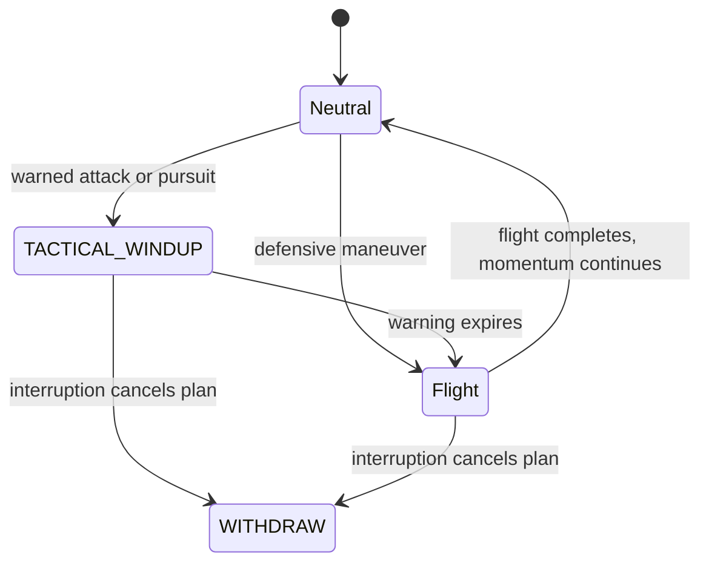

# Combat motion and enemy readability

The approved faceted fleet now uses rigid articulated panels, with short anticipation, an attack impulse, and a smooth return to flight. The existing pixel planets and PixelPlanets-inspired enemy materials remain the visual reference.

## Readability

| Enemy | Hull size increase | Contact envelope increase |
| --- | ---: | ---: |
| Redjack / basic | 50% | 35% |
| Razorwing / fast (including courier) | 65% | 40% |
| Verdant / bomber | 45% | 30% |
| Bastion / tank | 30% | 22% |
| Lancer / sniper | 55% | 40% |

The contact envelopes remain inset and keep their existing world alignment. Animation never changes a hitbox. Tank armor orbits move outward by 30% to clear the larger hull. Bosses retain their established scale and receive the new articulation.

## Motion and triggers

- Basic: panel tuck during the existing 0.55-second charge warning, then a folded charge pose.
- Fast/courier: restrained wing movement in flight; fast enemies fold during phase warnings and spin through a flank or roll into a physical dodge.
- Bomber: bay panels open 0.4 seconds before a bomb, release on the actual drop, then close. Mine drops also trigger release motion.
- Tank: armor braces before ordinary bursts and overload warnings; recoil follows each emitted volley.
- Sniper: rails spread during the aim warning and recoil on the actual shot. The pooled rail beam drives its release frame too.
- Bosses: all five variants articulate during their own warnings and volleys; interrupted core charges and phase transitions clear the held pose.
- Player: all three hulls have a quiet wing cycle, weapon recoil, folded boost flight, recoil while boosting, and an upgrade flourish.
- Upgrades: all 13 modules deploy when installed. Mounted modules copy the hull's blended bone pose, keeping armor and engines attached. Shield burst and overclock pulse when their gameplay abilities activate.

The actor's physics clock advances the clips. Windups hold until gameplay releases them; animation does not determine damage or spawn a projectile. Damage feedback cannot overwrite a held warning. Rapid fire restarts recoil immediately, and pause/reset stops or clears the motion. Muzzle and engine wrappers resolve the current bone transform before projectile emission, avoiding deferred attachment updates.

## Editable assets

`assets/models/animated/sources/farinuff_combat_motion.blend` contains 26 asset scenes: five regular enemies, five bosses, three player hulls, and 13 modules. Each scene contains an editable four-bone rig with NLA clips. The geometry and palettes come from the project's existing GLBs; every connected hard-surface part has a single rigid bone weight. Mesh counts are unchanged.

Rebuild inside Blender with `tools/build_combat_motion_blender.py`. It writes the animated GLBs and their manifest into `assets/models/animated/`. The approved static model sources remain available. The source directory is excluded from Godot import with `.gdignore`.

The three player hulls also run `tools/detail_butterfly_player_blender.py` during this build. Layered wing cells, branching spars, recessed panel seams, vents, concentric eyespot sensors, a framed canopy, segmented abdomen, antenna collars and hollow tail turbines raise each hull from 828 to 6,660 triangles. All detail shares the original mesh, material slots and four rigid bones; the seven socket transforms and seven animation clips are preserved. The source `.blend` includes the detailed models. See [the player detail preview](../player-detail/README.md).

## Review and validation

Run `res://scenes/combat_motion_review.tscn` for a repeating motion lineup; Space pauses it. The top row is explicitly magnified 2.2× and the player examples 2.8×. `motion-preview.gif` captures one deterministic four-second cycle. `combat-1080p.png` shows the actual gameplay scale with 15 active enemies; `boss-windup.png` shows the Tempest rig in game.

Validated on Godot 4.6.3, Metal Forward+, at 1920×1080. The 15-enemy combat sample held 60 FPS. This is a local visual check, not a maximum-load benchmark.

`tests/combat_motion_smoke.tscn` covers real enemy release events, moving sockets, stable hitboxes, all three player hulls, boost/recoil, rapid fire, module alignment, shield/overclock activation, pause and reset. It runs in CI alongside the existing native completion and visual smoke tests. Existing ObjectDB/resource/DummyShader shutdown warnings remain in the headless native harness.

## Native hull aerobatics

`effects/enemy_flight_motion_3d.gd` presents whole-hull maneuvers above the wing and weapon clips. Each scene selects a `flight_style` in the inspector. Full maneuvers identify combat actions; ordinary cruising adds quiet pitch and a pronounced, damped bank into actual turns.

Flight distances are tuned in baseline combat pixels, across a 3,300-pixel vertical span; these are not display pixels. Paths now use broad sweeps that read at the normal 220-world-unit camera zoom and existing hull scale. Most tactical arcs travel roughly two to three times farther, with slightly longer flight times to keep the turn readable. Barrel dodges travel at least 420 baseline pixels when space permits, phase dashes move 420, bomber jinks move 280, and knife-edge lane changes move 520. Pursuit routes widen their control points while retaining a target-relative standoff. All points still clamp the complete hull inside the arena.

Fighter/interceptor turn banks can reach about 49/60 degrees, with distinct heavier banks for bombers, tanks, snipers, and capital ships. Wingovers, reversals, and dive/climb poses use larger angles; knife-edge holds an almost vertical bank across the middle of its route. Full axial rolls retain their complete turns. Reflection duration, warning times, cooldowns, and Reduced Motion remain independent of the animation blend.

The tactics smoke test projects every tactical route in both directions through the normal overhead and angled cameras. At the arena center, each route must span at least 7% of the viewport height. The motion smoke test also checks that ordinary turns and combat banks visibly tilt every hull style. Existing checks continue to bound path speed, keep the rotating hitbox inside the arena, and verify warnings, collisions, sockets, and immediate returns to flight.

| Maneuver | Combat role and counterplay |
| --- | --- |
| Aileron roll | Generation II–IV basic and fast fighters anticipate incoming fire, show an amber warning for 0.3 seconds, then reflect up to three player shots during a 0.85-second roll. The warning remains vulnerable; expiration or exhausted charges return directly to normal flight. |
| Barrel roll | Basic and fast fighters physically move along a curved path perpendicular to incoming fire. The dodge measures the scaled hull and commits lateral thrust early enough to clear the original lane, then carries speed into the new lane. Collisions stay enabled throughout. |
| Spin transition | Generation IV fast fighters use their existing 0.4-second phase warning, spin across a flank over 0.55 seconds, reverse their next approach, and continue flying immediately. |
| Wingover | Snipers withdraw from a closing player along a 1.2-second curved path to gain firing distance before reacquiring their aim. Departing enemies also bank into withdrawal. |
| Bank reversal | Generation III–IV bombers change lane and orbit direction while suspending payload drops. Tank braces reverse their orbit and armor rotation while pulling plates inward. Boss banks follow the existing physical dodge. |
| Continuous exit | Charges, dodges, reflections, spins, wingovers, and tactical flights return straight to ordinary movement. Hull poses blend out while the craft keeps flying. |

Fighters alternate a preference for reflecting and dodging, subject to approaching shots, available space, and cooldowns. Reflection has a four-second cooldown and shares the 2.5-second defense cooldown with dodging. Generation I fighters remain introductory enemies. Couriers retain their straight objective route.

Reflected shots reverse the incoming direction at a bounded speed of 320–520 screen-equivalent pixels per second. They use the hostile projectile pool with one damage and no inherited homing, piercing, or explosion effects. The player can boost-reflect them for normal countershot damage, including through an active enemy roll. Countershots cannot enter an endless reflection loop. A full hostile pool lets the original shot hit normally; clearing projectiles cancels queued reflections. The amber ring and remaining-shot label stay visible with Reduced Motion. Flight School explains the counterplay.

The physics state owns timing, displacement, collision, and reflection; the presentation layer only poses the hull. Full rolls use continuous angular travel, quintic easing, and a short transition blend. Barrel rolls add a small helical visual offset. Imported bone sockets and unrigged markers follow the posed hull while warning and armor parents remain under gameplay control. Maneuver paths clamp the whole contact envelope inside the arena. Pause freezes both motion and defense time; Reduced Motion suppresses hull aerobatics without changing combat behavior or hiding the reflection tell.

`tests/enemy_flight_motion_smoke.tscn` covers full rotations, interrupted-spin blends, warning holds, socket alignment, independent presentation timing, boss facing, pause, Reduced Motion, and the absence of misleading cruise rolls. `tests/enemy_maneuver_smoke.tscn` exercises real projectile damage and pooling, upgraded-shot reflection, boost counters, warning/post-roll vulnerability, capacity/expiry/cooldowns, actual moving-shot dodges, arena bounds, and each archetype's functional maneuver. Both belong to the extended smoke suite:

```sh
python3 tools/run_smoke_tests.py --godot "$GODOT_PATH" enemy_flight_motion_smoke enemy_maneuver_smoke
```

## Tactical flight decisions

`systems/enemy_tactics_3d.gd` supplies perception, decisions, and path geometry to the regular enemies' FSMs. It observes on a staggered 0.22-second cadence, samples at most 64 nearby shots and 32 allies, remembers recent fire and damage, and scores maneuvers by the current situation. Pressure decays over time. Per-craft pressure, flanker, and cautious tendencies change pursuit preference, retreat thresholds, and cooldowns. The planner has no separate phase machine and never advances an actor's state, state timer, animation, or payload clock.

| New maneuver | Use |
| --- | --- |
| Split-S | Generation III–IV fighters half-roll into a descending reversal to gain distance when damaged or facing a closing player boost. |
| Immelmann | Generation II–IV fighters pitch through a half-loop and roll level to reacquire a target behind their flight path. A 0.28-second path warning precedes the committed turn; two aimed shots release as the turn levels out. |
| Scissors | Generation III–IV fighters under sustained incoming fire make two opposing curved jinks while opening distance. The real collision envelope follows both changes of direction. |
| Corkscrew | Generation III–IV fighters make a double-roll flank toward a bounded prediction of the player's position, releasing a four-shot sweep across that lane. The route has a 0.42-second warning, consumes a local attack slot, and cannot chase a changed player position after commitment. |
| Knife-edge | Generation III–IV snipers bank almost vertically and slip sideways when an ally blocks their firing lane, then flow directly into aiming again. |

All travel stays on the combat plane; rolls and loops pose the hull above it. These maneuvers grant no immunity or additional reflection. Maneuvers return directly to normal flight, retaining a 4.5–5.1-second cooldown and an eight-second repeat lock. Incoming threats take priority over pursuit turns and flanks. Generation I retains its introductory behavior. Maneuvers decline when the arena leaves insufficient room, and their paths account for the full rotating hull. Reduced Motion retains displacement, decisions, and path warnings while suppressing the hull animation.

Squad behavior uses local observations: allies spread out, dodge choices weigh nearby craft and projected bullet lanes, and tanks steer toward a screening position in front of wounded allies. Snipers change firing angles instead of sitting behind other hulls. At most two nearby enemies can commit a charge, phase dash, Immelmann, corkscrew, low yo-yo, or bombing run at once; completion or destruction releases an opening. This slot check reads current intentions so simultaneous decisions cannot all claim the same opening. Lane scoring also reads committed routes, encouraging two attackers to take opposite flanks even if they observed the squad before either committed.

`get_debug_state().tactics` reports tendency, pressure, incoming threats, blocked firing lane, screening status, last maneuver/reason, and cooldown. `tests/enemy_tactics_smoke.tscn` covers collision-course prediction, decaying pressure, each maneuver's selection and displacement, locked endpoints, squad slots, ally spacing/screening, arena constraints, real projectile damage after a maneuver, both animation directions, pause, destruction, and Reduced Motion.

```sh
python3 tools/run_smoke_tests.py --godot "$GODOT_PATH" enemy_tactics_smoke enemy_maneuver_smoke enemy_fsm_smoke enemy_flight_motion_smoke
```

## Advanced pursuit and bomber runs

| Maneuver | Use and opening |
| --- | --- |
| High yo-yo | Generation IV fighters respond to a close target crossing their nose with a pitched, banked braking turn that opens lateral space. The path has a 0.28-second warning and takes 1.6 seconds. |
| Low yo-yo | Generation IV fighters dip into a tighter 1.35-second pursuit cut when the player is moving away. A 0.4-second warning locks the route and target for a three-way volley during the pull-through; changing direction can defeat the prediction. |
| Hammerhead | Generation III–IV fighters approaching an arena edge pitch up, stall, pivot, and dive back into open space over 1.7 seconds. The contact envelope actually pauses at the apex for about 0.31 seconds and remains vulnerable. |
| Bombing run | Generation III–IV bombers show their route, target ring, and projected firing lanes for 0.65 seconds. They sweep through a 1.6-second banked pass, releasing three ordinary pooled bombs from spaced points toward the fixed advertised target. |

The yo-yos require a healthy hull, low recent pressure, and no imminent incoming fire or player boost. Hammerheads provide an arena-boundary response; they do not interrupt a committed weapon warning. Like other tactical flight, all four maneuvers keep collision active and carry momentum straight into normal flight. Pitch is visual; physical travel and projectile collision stay on the combat plane.

Generation IV fighters can combine at most two maneuvers. A corkscrew may open a high yo-yo opportunity, and a high yo-yo may open a low yo-yo opportunity. Immediately after completing a maneuver, the craft has 0.9 seconds to observe a suitable change in player movement. New fire, damage pressure, low health, boosting, another combat state, or expiry cancels the opportunity. The second move gets its own full warning and must respect the squad attack budget. It cannot start a third move; normal cooldown resumes. Debug state reports the pending follow-up and sequence depth.

Bombing runs replace the ordinary bomb cadence while active, pause mine scheduling, and never interrupt an ordinary payload that is already winding up. Release locations are sampled from the committed path, so a slow frame cannot stack all bombs at the endpoint. The three-release budget remains fixed, targets do not follow a dodging player, and destroying the bomber cancels unreleased payloads. The existing pool bounds, damage, and non-homing projectile behavior apply. Reduced Motion preserves the route and target warning, real movement, and payload timing.

`tests/enemy_advanced_tactics_smoke.tscn` covers situational selection, opposite flank reservations, shared bomber/fighter attack slots, direct exits and sequence limits, threat/expiry/interruption cancellation, locked bomb aim, coarse-frame payload spacing, arena boundaries, continuous poses in both directions, pause, destruction, and Reduced Motion.

```sh
python3 tools/run_smoke_tests.py --godot "$GODOT_PATH" enemy_advanced_tactics_smoke
```

## Maneuver attacks

Basic and fast fighters fire through three of their existing maneuvers. Immelmann turns release two aimed shots at 66% and 84% of the flight. Corkscrews release four shots at 28%, 42%, 56%, and 70%, sweeping from −10° to +10° around the committed aim; the sweep mirrors with the roll direction. Low yo-yos release a simultaneous three-way fan at 62%, with 14° gaps. Bombers retain their three-payload bombing pass.

Gold target rings, dashed firing guides, and the remaining shot count appear during the existing warning and remain until the last release. Aim locks before the warning, so dodging does not make the burst track the player. Each shot uses the pooled hostile projectile path, one damage, ordinary speed, and no homing. Recoil plays alongside the hull roll without restarting it. Release locations follow the committed route even when a long frame crosses multiple shots. Pool saturation consumes the scheduled release instead of growing the pool or deferring an unexpected burst.

`systems/enemy_maneuver_attack_3d.gd` has no independent timer or FSM. The owning flight state advances releases; withdrawal, destruction, completion, or another interrupt cancels pending shots and clears their warning. The two-attack squad budget includes Immelmann turns. Armed moves still return directly to moving flight. Defensive rolls, scissors, Split-S escapes, knife-edge slips, high yo-yos, and hammerheads retain their existing movement roles.

`tests/enemy_maneuver_attacks_smoke.tscn` checks both fighter types at 30 and 120 Hz and with deliberately coarse frames: warning order, fixed aim, sweep/fan geometry, shot budgets, real player damage, continuous exit, cancellation, squad limits, full pools, pause, and Reduced Motion.

```sh
python3 tools/run_smoke_tests.py --godot "$GODOT_PATH" enemy_maneuver_attacks_smoke
```

## Continuous movement

Maneuvers have no post-flight recovery state. Paths inherit their entry velocity and finish at cruise speed; scissors shares velocity across its two cuts. The hammerhead keeps its intentional apex stall as part of the maneuver. Phase dashes use an eased committed path, and barrel dodges retain a short, responsive acceleration ramp for clearing incoming fire. The enlarged arcs and all collision checks remain active.

Normal flight eases speed changes, limits heading turns, and blends withdrawal from the current velocity. Hull banks use a critically damped response, maneuver transitions blend over 0.24 seconds, and enemy wing clips blend over 0.1 seconds. These blends run alongside movement and decision making. Snipers blend toward their aim without a competing movement-facing update. Cooldowns, warning windows, and the two-attack squad limit remain enforced; follow-up opportunities open as soon as a maneuver completes.

The tactics smoke test checks velocity at entry, the scissors crossover, and exit, plus the next normal-flight frame at 30 and 120 Hz. FSM traces require direct flight-to-neutral transitions, and bomber scheduling resumes immediately after the third committed payload.

## FSM ownership

The regular-enemy FSM is the single authority for maneuver timing and presentation. A neutral state requests a plan, then enters `TACTICAL_WINDUP` when required, the named flight state, and its normal neutral state. Fighters and bombers return to `TRANSIT`; snipers return to `HOLD`. Defensive maneuvers without an attack warning enter their flight state directly. State entry starts the corresponding hull animation and wing pose; state exit clears warnings and smoothly unwinds an interrupted pose. Reflection, barrel dodge, phase dash, and charge also return directly to `TRANSIT`. Tank overload releases to normal flight while its weapon rearm timer runs independently.



Only the owning archetype and generation can request a maneuver. Fighters learn pursuit turns, escapes, flanks, and energy turns; snipers use knife-edge lane changes; bombers use bombing runs. Tanks retain their brace/overload bank reversals, bosses retain their BossAI attack cadence and continue moving across dodge transitions, and couriers keep their objective route. Changing a visual flight style does not grant another archetype's flight states. A flight request requires a prepared route, the right predecessor, and an expired warning. A long physics frame crosses only one boundary and starts the next state's full duration.

Normal bomb drops now use an explicit `BOMB_WINDUP` state, preserving the full 0.4-second warning before release. Sniper rails use `RAIL_AIM` until the pooled beam actually releases; a wingover or knife-edge cannot interrupt that warning. Interruptions immediately cancel unreleased rails, tactical payloads, route reservations, phase/aim tells, and held warning poses. Tank state exits restore braced armor and release overload reservations. Actual weapon recoil survives the return to normal flight.

`tests/enemy_fsm_maneuvers_smoke.tscn` reaches all nine tactical maneuvers through normal physics decisions, checks their complete transition traces and animation bindings, and exercises automatic aileron reflection/barrel dodging, invalid/early state requests, coarse-frame timing, archetype guards, cancellation, ordinary bomb cadence, and rail commitment. The scene can keep running for MCP inspection with `quit_when_complete = false`.

```sh
python3 tools/run_smoke_tests.py --godot "$GODOT_PATH" enemy_fsm_maneuvers_smoke enemy_fsm_smoke
```
