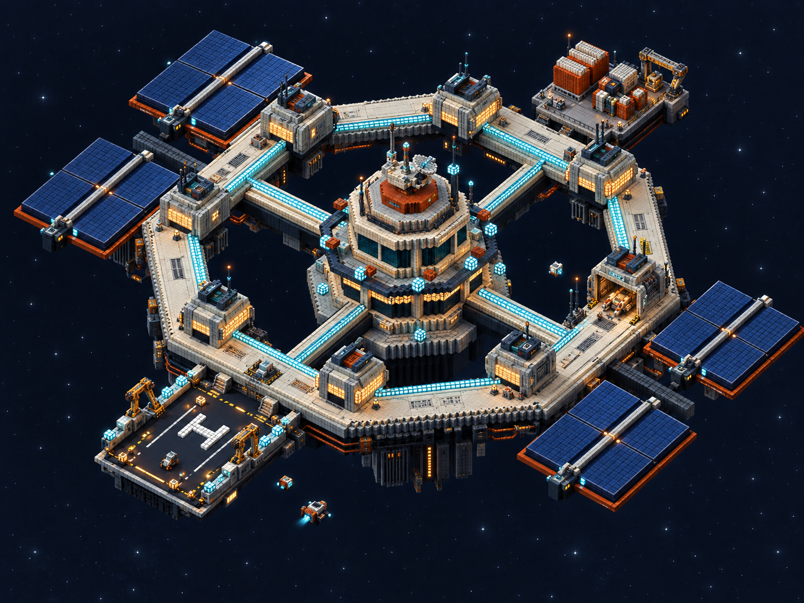
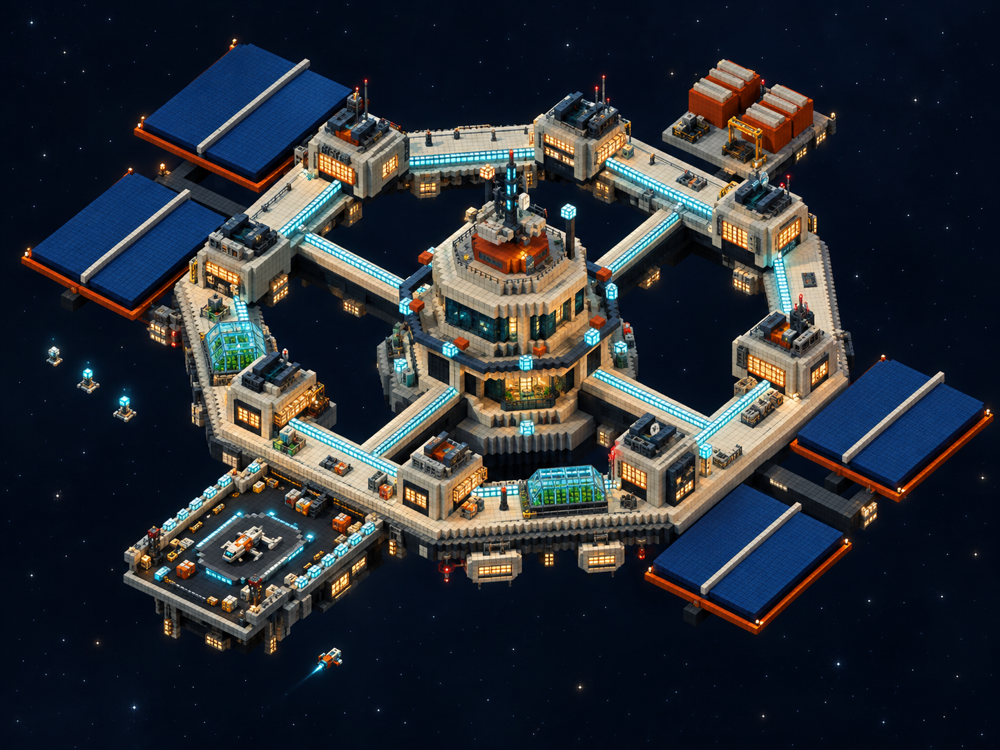
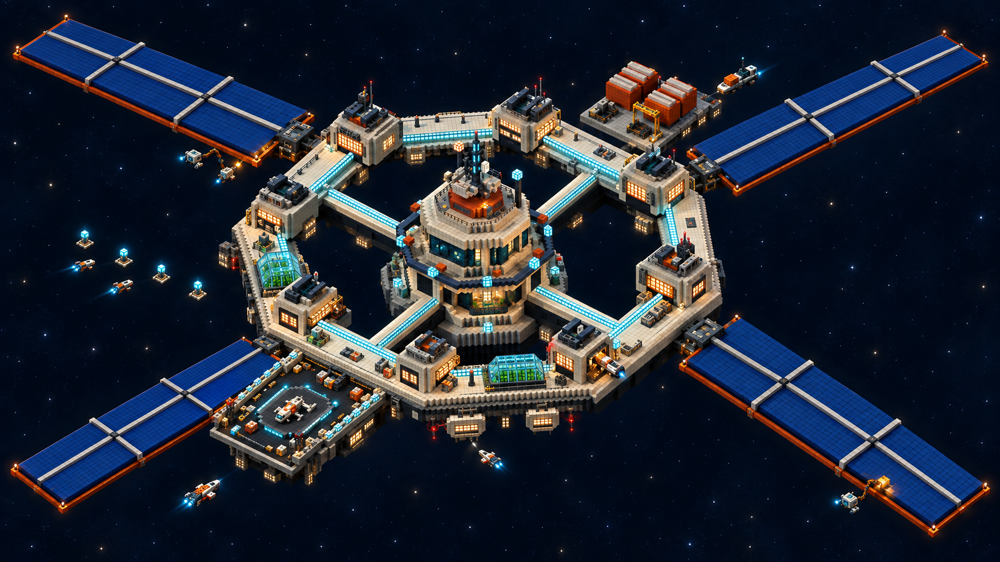
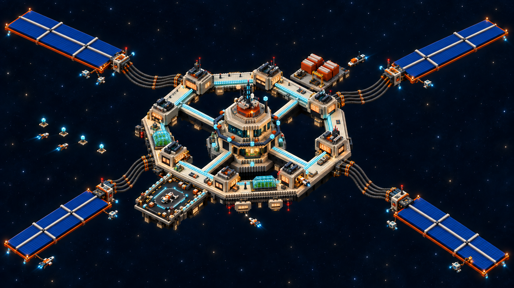
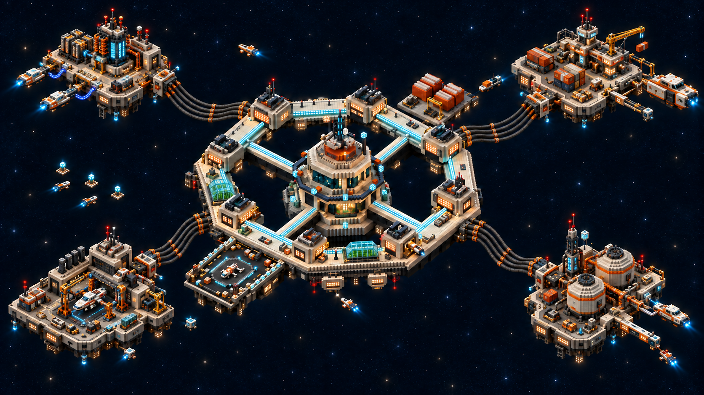

# Wayfarer detail studies

Image-generation concept mockups based on the existing Blender model render and the current home-port gameplay view. These are visual studies for a future modeling pass; they do not change the Blender mesh or game assets.

The selected direction is **Crescent Harbor, spacecraft revision**. Five uneven industrial relay islands form a loose crescent around an open arrival basin, retaining the warm, inhabited Wayfarer spaceport and heavy power-cable connections. Sealed cargo pod carriers, reaction-control thrusters, docking collars, and compact shuttles make the visiting fleet read clearly as vacuum spacecraft.

The [asymmetric layout studies and selected spacecraft revision](asymmetric-layouts/README.md#01--crescent-harbor-revision-2-spacecraft) replace the earlier symmetric placement. Crescent Harbor was selected from three compositions; its latest revision keeps that layout while replacing the cargo-ship appearance, rope-suspended cranes, and helipad markings with spacecraft forms, articulated robotic arms, and docking guides. All previous concepts remain below. The selected revision is still an image concept for a future modeling pass.

## 01 — Orbital Dockyard

Recessed hangar machinery, service cranes, docking clamps, cargo handling, and exposed structural systems. This direction gives the station a clear working purpose and makes good use of the current docking apron.

## 02 — Lived-in Home Port

Warm habitat windows, modular cabins, enclosed hydroponics, and observation areas. This direction emphasizes the station as a home the player returns to between expeditions.

## 02 — Lived-in Home Port, revision 2

The revised concept keeps the warm habitation character, open ring, and central tower, while emphasizing longer rectangular solar wings and visible activity around the station. Repair drones work beside the arrays, cargo traffic approaches the rear platform, a ship uses the recessed service bay, and small craft train near the blue beacons. Existing service positions remain constraints for a future modeling pass. The exact edit request is saved in [02-lived-in-home-port-v2-prompt.txt](02-lived-in-home-port-v2-prompt.txt).

## 02 — Lived-in Home Port, revision 3: solar satellites

This concept for a future modeling pass separates all four elongated solar arrays from the main station onto satellite platforms. Thick power-cable bundles span the gaps, with visibly separated heavy strands and reinforced anchor points at both ends. Broad open spaces between the station, cables, and platforms preserve clear fly-through routes. The home-port detailing and ships maintaining the station or using its services carry forward from revision 2. The edit request is recorded in [02-lived-in-home-port-v3-prompt.txt](02-lived-in-home-port-v3-prompt.txt).

## 02 — Spaceport Relay Islands, revision 4

This image concept replaces the four flat solar arrays with thick, compact industrial platforms. Electrical relay towers, insulators, capacitor and transformer banks, and exposed busbars give them the appearance of working power infrastructure. Heavy cable bundles and reinforced anchors connect the islands to the station while preserving open flight corridors.

Each island has a distinct function: charging and power distribution, cargo and logistics, repair and maintenance, or refueling and traffic control. Varied ships approaching, leaving, docking, and receiving service establish the main station as an active spaceport. The central tower, inhabited ring, and existing service locations remain anchors for a future modeling pass. This is a still-image concept only; no Blender or game assets are modified. The edit request is recorded in [02-lived-in-home-port-v4-prompt.txt](02-lived-in-home-port-v4-prompt.txt).

The planned Frontier Observatory direction was interrupted before it produced an output; no image from that direction is included here. Its original prompt remains in the prompt record.

## Modeling priorities

Develop the selected Crescent Harbor spacecraft revision. Its five uneven relay islands and open arrival basin supersede the earlier symmetric placement and flat solar wings. Keep the open ring, central tower, six service positions, and tiny player scale. Give each island a readable working purpose through its silhouette, electrical equipment, docking facilities, and service craft. Make the heavy cable strands and reinforced anchors visible without obstructing flight routes. Use vacuum spacecraft with sealed cargo pods, maneuvering thrusters, docking collars, and robotic cargo handling to communicate a busy spaceport. Group smaller details around major landmarks and preserve quiet hull surfaces. Treat generated geometry as a design suggestion to reconcile with the actual mesh.

## Traffic and maintenance animation concepts

These are ideas for future implementation, not animations currently added to the game or Blender asset.

- **Relay inspection drone:** travel slowly beside a cable anchor or transformer bank, pause for a scan, and check the next component before moving on.
- **Hull repair crew:** a compact workboat holds position beside a service building while an articulated arm reaches toward a hull panel; brief work lights identify the repair.
- **Cargo delivery:** a pod carrier approaches the Hangar, waits clear of the player's flight lane, docks through a collar, and transfers a sealed cargo module with an articulated robotic arm before departing.
- **Visitor service cycle:** a small ship lands at the Launch Bay, idles while guide lights change, then lifts off and follows an outward departure route; a separate practice craft can wait near Flight School.

Generated with the built-in image generation tool. The complete prompt set and reference paths are recorded in [prompts.json](prompts.json).
