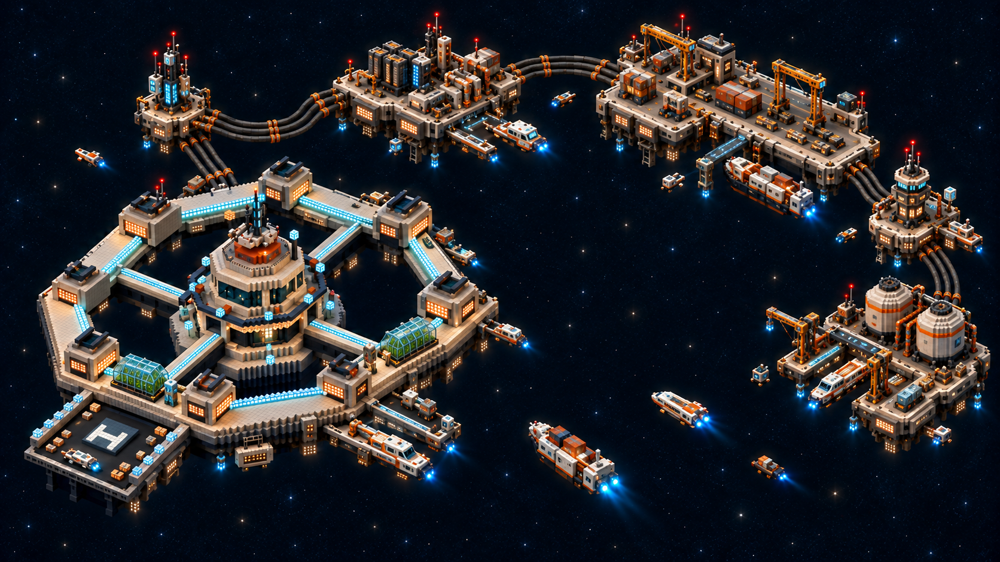
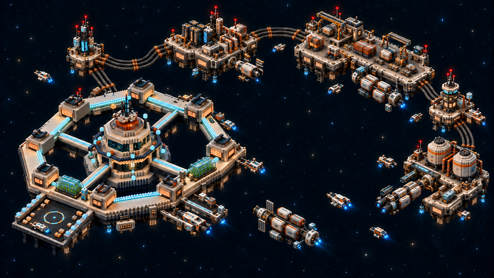
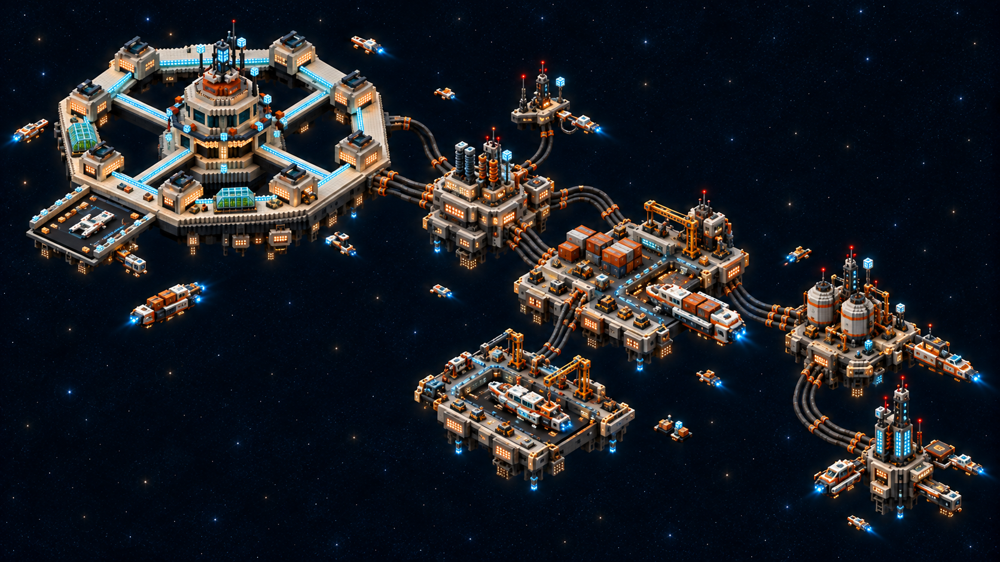
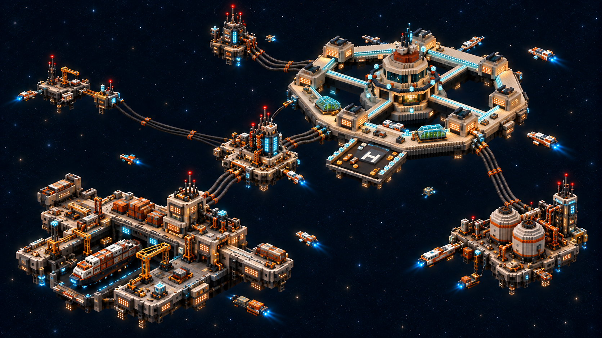

# Wayfarer asymmetric layout studies

Three independent composition studies respond to the request for novel, asymmetric relay placement. They use the original Wayfarer model and revision 4's relay equipment as shape and material references, while discarding revision 4's layout. **Crescent Harbor is selected**, with its spacecraft revision below as the latest direction.

These are still-image concepts for a future modeling pass. They do not modify Blender geometry, game assets, service locations, or flight behavior. The built-in image generation requests and reference paths are recorded in [prompts.json](prompts.json).

## 01 — Crescent Harbor

The main station sits toward the lower left. Five uneven relay islands form a loose crescent along the upper and right edges, leaving a wide, open arrival basin for approaching and departing ships. Unequal island sizes, gaps, and cable lengths create a port that appears to have grown around its traffic routes.

**Tradeoff:** the basin offers a clear arrival landmark and room to show active traffic, but distant outer islands may need separate framing or stronger navigation cues during flight.

## 01 — Crescent Harbor, revision 2: spacecraft

The selected revision preserves the crescent layout and replaces the ship-like freighter with an unmistakable vacuum spacecraft: sealed modular cargo pods attached to an axial spine, reaction-control thrusters, and docking collars. Compact shuttle silhouettes distinguish passenger and service traffic. Articulated robotic arms replace rope-suspended cranes, and docking guides replace H helipad markings.

These details establish how ships maneuver, dock, and transfer cargo in space while retaining the open arrival basin and active station services. This is a still-image concept for future modeling; it does not modify the actual game or Blender assets. The edit request is recorded in [01-crescent-harbor-v2-prompt.txt](01-crescent-harbor-v2-prompt.txt).

## 02 — Branching Relay Chain

The main station sits near the upper left. Six varied relay islands extend diagonally right and down in a branching daisy chain. Cables run between neighboring islands; not every node connects directly to the main station. Cargo, maintenance, and power services create distinct stops along the branches.

**Tradeoff:** the chain suggests purposeful journeys between services and makes cable routing legible, but its long footprint could spread routine interactions too far apart or leave branches outside the camera view.

## 03 — Layered Spaceport

The main station is elevated toward the rear right. Five islands occupy genuinely different heights and depths: a large, low cargo dock in front, a compact high relay mast, and three smaller service satellites at irregular positions. The layout avoids a flat wheel or grid, with open routes weaving between structures and cable spans.

**Tradeoff:** the height differences create the strongest sense of a large inhabited spaceport, but overlapping silhouettes and projected cables could hide the player or confuse which routes are traversable. A future implementation would need to reconcile this vertical composition with the game's flight plane and camera.

All three retain a small player craft for scale, visibly arriving, departing, and berthed ships, and clear flight spaces between infrastructure. Return to the [full Wayfarer detail study history](../README.md) for earlier concepts.
