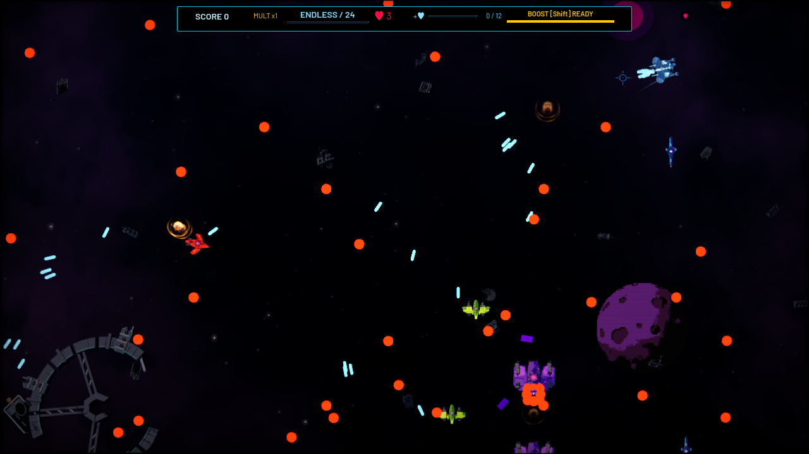

# Candidate performance capture

Captured from the Godot 4.6.3 **release** runtime on macOS/Metal, September 19,
2026, using the identified non-shipping benchmark PCK. High graphics, 1280 × 720,
seed 8026, assisted generation-four pressure at Wave 24.

This is an invulnerable, durable-enemy stress fixture with seven enabled upgrades,
replenished enemies and simultaneous hazards. It is performance evidence, not a
natural-play or storefront capture. The full run used background diagnostic mode;
its frame timings do not establish foreground hardware acceptance.

[Protocol](../../docs/candidate-performance.md) ·
[Build identity, measurements and capture hash](../../docs/validation/candidate-performance-2026-09-19.json)

Raw samples, runtime log, RSS observations, configuration, report and checksums
are retained locally in `builds/production-performance-evidence/`.
