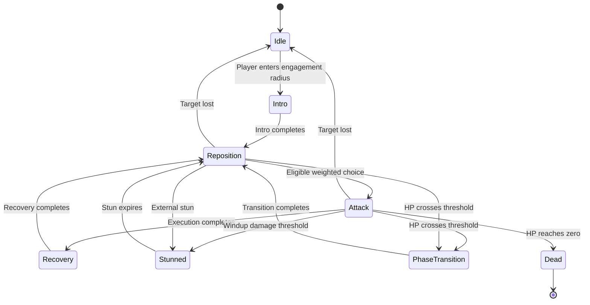

# Boss finite-state AI

All five boss hulls use the same explicit finite-state machine. Attack choice is a weighted draw over hand-authored rules; there is no machine learning, saved behavior model, or input inspection.

## Components

| Component | Responsibility |
| --- | --- |
| `BossAI` | Engagement, combat states, bounded motion prediction, and coordination |
| `BossFlightOrchestrator` | Smooth pursuit, combat distance, authored maneuvers and arena bounds |
| `BossAttackSelector` | Eligibility, weighted choice, per-encounter cooldowns and repetition history |
| `BossAttackDefinition` / `BossCombatProfile` | Inspector-editable attack and encounter tuning |
| `BossAttackPlan` | Snapshot of aim, target, phase, damage and timing at commitment |
| `BossAttackExecutor` | Telegraph, release, charge displacement and projectile sequence timing |
| `BossProjectilePatterns` | Five hulls' projectile formations, escape gaps and delayed echo marks |
| `BossCombatPresentation` | Facing, existing ship animations, world telegraphs and HUD cues |
| `BossHitResolver` | Slam radius and swept charge collision; one hit per target per attack |
| `BossHealth` | HP, phase thresholds and death |
| `boss_enemy_3d.gd` | Spawn/finish integration, hull sections, rewards and the sole hull transform writer |

The scene wires these under `BossEnemy3D/BossAI`, with `Health` as a sibling. Animation continues to use `ShipMotion3D`; projectile hit routing continues through `ProjectileManager3D` and `Player3D`.

## State flow



Phase changes and death can interrupt any living combat state. A missing player immediately cancels offense; leaving the larger disengagement radius requires the configured grace period. Reacquisition starts a fresh Intro. Recovery, Stunned, Intro and Phase Transition hold movement and prevent new attacks. Existing projectiles can still travel during ordinary Recovery; delayed echo emissions finish before Recovery begins. Stun, phase changes, disengagement and death clear queued offense and the enemy field.

Only one state boundary is processed per tick. A slow frame cannot spend the same elapsed time on a warning and its damaging execution. The game’s existing pause guard freezes all encounter timing.

## Phases and attacks

| Phase | Remaining HP | Repertoire and timing |
| --- | --- | --- |
| 1 | Above 60% | Melee slam and primary projectile pattern |
| 2 | 60% through 30%, inclusive | Adds charge; cooldowns ×0.82, recovery ×0.9 |
| 3 | Below 30% | Adds alternate projectile pattern; cooldowns ×0.65, recovery ×0.65 |

Large hits skip directly to the appropriate phase. Death takes precedence over a phase crossing. HUD threshold markers use the same configured thresholds as health.

| Attack | Selection range, pixels | Base cooldown | Telegraph | Base recovery | Counterplay |
| --- | --- | --- | --- | --- | --- |
| Slam | 0–220 | 5 s | 1.1 s | 1.7 s | Leave the orange 240-pixel radius circle |
| Charge | 280–1000 | 11 s | 1.3 s | 2 s | Sidestep the fixed lane, then punish the recovery |
| Projectile | 230–1200 | 5 s | 1.3 s | 1.6 s | Bait the aim, then move through an authored gap |
| Alternate projectile | 230–1200 | 8 s | 1.5 s | 1.8 s | Read the phase-three formation and staggered speed layers |

Cooldowns begin with commitment, including interrupted attacks. Phase transitions do not refund cooldowns or reset repeat history. Both projectile patterns count as the same attack family: after two projectiles, another projectile is forbidden until slam or charge is committed. If no alternative is currently legal, the boss moves toward an alternative's range or waits.

Weight combines ideal-distance proximity, signed player radial speed (approaching versus retreating), phase aggression and a penalty for the previous family. Eligibility checks ranges, phase unlock, cooldown and the hard repetition limit before the draw. `selection_seed` makes choices reproducible for testing.

The boss faces and follows visible player motion between attacks. Prediction uses at most 0.25 seconds of current velocity and 100 pixels of lead by default. Aim locks at telegraph start; reversing or braking afterward defeats the prediction. A charge follows one straight, bounded segment and cannot turn after its warning. Its hit resolver sweeps the full traveled segment to prevent tunneling on slow frames. Body and pod contact cannot bypass the attack warning.

Sustained damage during a windup can stun the boss: default threshold is 4% of maximum HP during that one windup. Stun lasts 1.4 seconds with an eight-second cooldown. `boss.stun(duration)` is also available to external abilities. Set `stagger_health_fraction` to zero to disable damage-triggered stagger.

## Tuning in Godot

1. Open `entities/enemies/boss_enemy_3d.tscn` and select **BossAI**. Assign **Profile Override** for a custom encounter, or edit a resource in `entities/enemies/ai_profiles/`.
2. The profile exposes engagement/disengagement, prediction, Intro/stun/transition durations, minimum reaction time, HP thresholds, cooldown/recovery multipliers and attack resources.
3. Attack resources under `entities/enemies/attacks/` expose ranges, weights, movement bias, cooldown, damage, telegraph/recovery durations, burst count/interval, slam radius, charge speed/distance/width and projectile speed scale. Keep charge's `minimum_phase = 1` and the alternate's `minimum_phase = 2` (zero-based) for the default unlocks.
4. Select **BossAI/Flight** to assign a flight profile override. `entities/enemies/flight_profiles/` exposes cruise speed, preferred distance, minimum separation, steering response, maneuver timing and authored flight paths. Keep minimum separation below your melee range. The FSM supplies target prediction; the flight profile's lead fields remain available to standalone flight callers.

All distances/speeds use the game's baseline screen-pixel conversion, not raw 3D units. Damage is measured in **lives**, because that is the game's health model; default damage is one. Shield and invulnerability checks happen once per attack hit. Pooled projectiles reset damage when reused. Shared resources contain tuning only; runtime cooldowns, histories and attack snapshots belong to each encounter. Duplicate a resource before editing when only one hull should change.

Phase aggression never shortens warnings. `minimum_reaction_time` provides a profile-level floor. Default projectile formations retain the existing global enemy and telegraphed-shot speed multipliers; `projectile_speed_scale` adjusts them without duplicating those multipliers.

Legacy arena pressure is off by default (`enable_arena_pressure = false`) so the encounter uses the three requested attack families. Its geometry remains available for explicitly authored encounters and regression tests. Core's old separate rail attack and Bulwark's autonomous pod mines are no longer scheduled by the standard boss.

## Debugging and validation

`BossAI.get_debug_state()` exposes state, phase, remaining state time, player distance/radial speed, predicted point, previous attack, repeat count, cooldowns and windup status. Signals `state_changed` and `attack_committed` expose decisions; the flight component retains `maneuver_changed` and its own debug snapshot.

Godot 4.6.3 smoke scenes:

```sh
godot --headless --path . res://tests/boss_ai_smoke.tscn
godot --headless --path . res://tests/boss_flight_smoke.tscn
godot --headless --path . res://tests/boss_patterns_smoke.tscn
godot --headless --path . res://tests/native_completion_smoke.tscn
godot --headless --path . res://tests/background_drift_smoke.tscn
```

The AI suite checks phase boundaries/unlocks, weighted motion preferences, cooldowns, strict shared-family repetition, engagement, every state, committed warnings, pause, damage payloads, shield behavior, charge sweeps, sidestepping, target loss and continued attack selection for all five hulls. The flight suite covers all 15 hull/phase routes, moving targets and edges. The pattern suite uses actual pooled shots to verify speed layers, motion, reflection, pod reductions and escape gaps. These establish behavior; reaction feel and encounter difficulty still need player feedback.
