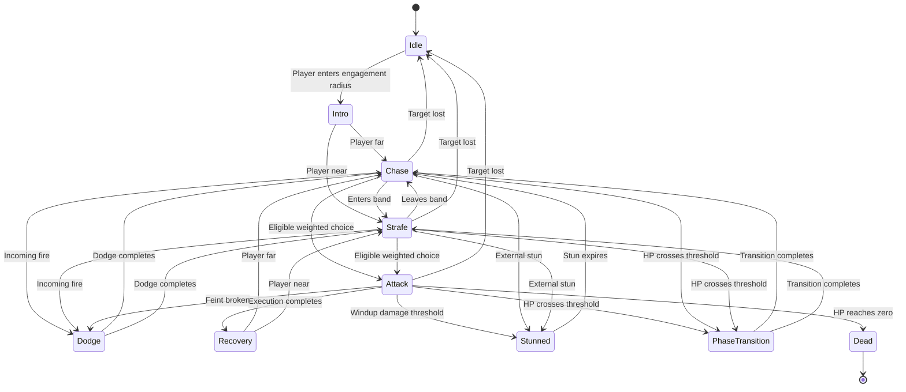

# Boss finite-state AI

All five boss hulls use the same explicit finite-state machine. Mobility states keep the hull flying around the player; attack commits carry a targeting mode and delivery style drawn from explicit rules. There is no machine learning, saved behavior model, or input inspection.

## Components

| Component | Responsibility |
| --- | --- |
| `BossAI` | Combat states, mobility transitions, targeting/style choice, bounded motion prediction and coordination |
| `BossMovementBrain` | CHASE, STRAFE and DODGE flight, arena safety and speed |
| `BossAttackSelector` | Eligibility, weighted choice, per-encounter cooldowns and repetition history |
| `BossAttackDefinition` / `BossCombatProfile` | Inspector-editable attack and encounter tuning |
| `BossAttackPlan` | Snapshot of aim, target, targeting, style, damage and timing at commitment |
| `BossTargetingPredictor` | Samples visible target motion and solves a bounded intercept point |
| `BossAttackExecutor` | Telegraph, release, TRACK re-aim, FEINT break, charge displacement and projectile sequence timing |
| `BossProjectilePatterns` | Five hulls' projectile formations, escape gaps and delayed echo marks |
| `BossCombatPresentation` | Facing, existing ship animations, world telegraphs and HUD cues |
| `BossHealth` | HP, phase thresholds and death |
| `boss_enemy_3d.gd` | Spawn/finish integration, hull sections, rewards and the sole hull transform writer |

Slam radius and swept charge collision resolve inside `BossAttackExecutor`, with one hit per target per attack.

The scene wires these under `BossEnemy3D/BossAI` with `Movement`, `AttackExecutor`, `Presentation` and `ProjectilePatterns` as children, and `Health` as a sibling. Animation continues to use `ShipMotion3D`; projectile hit routing continues through `ProjectileManager3D` and `Player3D`.

## State flow



Phase changes and death can interrupt any living combat state. A missing player immediately cancels offense; leaving the larger disengagement radius requires the configured grace period. Reacquisition starts a fresh Intro. Intro, Stunned and Phase Transition hold movement and prevent new attacks. Recovery keeps the hull drifting slowly so it never parks. Existing projectiles can still travel during ordinary Recovery; delayed echo emissions finish before Recovery begins. Stun, phase changes, disengagement and death clear queued offense and the enemy field.

Only one state boundary is processed per tick. A slow frame cannot spend the same elapsed time on a warning and its damaging execution. The game's existing pause guard freezes all encounter timing.

## Mobility

| Mode | Behavior | Counterplay |
| --- | --- | --- |
| Chase | Pursues the predicted player at a surge speed and opens distance if contact gets too close | Break line with lateral motion |
| Strafe | Orbits the player at the preferred band with a woven ring and a constant tangential drive | Match the ring and punish the tell |
| Dodge | Snappy lateral jink away from an incoming Player Projectile | Feint a shot to force the jink, then punish |

Chase engages when the player leaves the preferred band by more than 180 pixels. Strafe is the default between attacks. Dodge fires only from Chase or Strafe and never during a committed tell. After two projectile volleys the ring closes toward a legal alternative's ideal range, so the hull cannot deadlock outside every remaining attack.

While chasing or strafing the boss also fires **continuous support shots** — one straight predictor-aimed shot every 0.38 seconds, tightening with each health phase. Support fire never runs during a committed tell, a dodge, or Recovery, so the punish window stays real.

All distances/speeds use the game's baseline screen-pixel conversion, not raw 3D units.

## Targeting and attack style

Each committed attack draws one targeting mode and one delivery style from explicit rules keyed to player radial/lateral speed, attack family and encounter sequence.

| Targeting | Aim | Counterplay |
| --- | --- | --- |
| Lead | Short-horizon intercept locked at the tell | Reverse or brake after the tell starts |
| Predict | Full intercept solution with acceleration lead, capped in pixels | Change course after the tell; the cap bounds the lead |
| Snap | Present position, shorter tell | Keep moving |
| Track | Predict refreshes its aim at a capped rate until release | Boost sideways at release |
| Bracket | Present position with a widened charge lane, slam radius or burst count | Leave the widened zone entirely |

The predictor samples visible target velocity over a half-second window, estimates acceleration, and iterates shot travel time against the extrapolated position. It reads motion only — never button state — and its lead is hard-capped so a boost cannot create an unbounded intercept.

| Style | Delivery | Counterplay |
| --- | --- | --- |
| Commit | Standard telegraph and recovery | Read the tell and dodge |
| Surge | Telegraph ×0.85, recovery ×0.55 | Punish the shortened recovery |
| Feint | Longer tell that breaks into a Dodge once past its cancel fraction and the player has already left the hit solution | Bait the break, then punish the dodge |

Charge always uses Lead so its lane stays honest. Slam prefers Snap. Projectile volleys aim through Predict, with Track taking every third volley from phase two. A closing player draws Snap; heavy lateral drift draws Bracket. Phase one rarely surges and occasionally feints; phase three alternates Commit and Surge.

## Phases and attacks

| Phase | Remaining HP | Repertoire and timing |
| --- | --- | --- |
| 1 | Above 60% | Melee slam and primary projectile pattern |
| 2 | 60% through 30%, inclusive | Adds charge; cooldowns ×0.82, recovery ×0.9 |
| 3 | Below 30% | Adds alternate projectile pattern; cooldowns ×0.65, recovery ×0.65 |

Large hits skip directly to the appropriate phase. Death takes precedence over a phase crossing. HUD threshold markers use the same configured thresholds as health.

| Attack | Selection range, pixels | Base cooldown | Telegraph | Base recovery | Counterplay |
| --- | --- | --- | --- | --- | --- |
| Slam | 0–280 | 5 s | 1.1 s | 1.7 s | Leave the orange 240-pixel radius circle |
| Charge | 200–1600 | 11 s | 1.3 s | 2 s | Sidestep the fixed lane, then punish the recovery |
| Projectile | 140–1800 | 2.2 s | 1.3 s | 1.0 s | Bait the aim, then move through an authored gap |
| Alternate projectile | 140–1850 | 3.2 s | 1.5 s | 1.1 s | Read the phase-three formation and staggered speed layers |

Iron Bulwark's projectile wall spans 17 lanes over 832 pixels with a single open lane that steps each volley, so a lazy strafe cannot clear it — commit to the breach or use boost. The outermost lanes are boost-breakers and disappear with their weapon pods.

Cooldowns begin with commitment, including interrupted attacks and broken feints. Phase transitions do not refund cooldowns or reset repeat history. Both projectile patterns count as the same attack family: after two projectiles, another projectile is forbidden until slam or charge is committed. If no alternative is currently legal, the hull closes toward an alternative's range or keeps strafing.

Weight combines ideal-distance proximity, signed player radial speed (approaching versus retreating), phase aggression and a penalty for the previous family. Eligibility checks ranges, phase unlock, cooldown and the hard repetition limit before the draw. `selection_seed` makes choices reproducible for testing.

The boss faces and follows visible motion between attacks and **never parks to perform one**. Every tell is flown through at reduced speed: the slam circle, charge lane and volley origin ride with the hull along the aim that was locked at telegraph start, so the read promise stays honest while the silhouette keeps moving. A charge follows one straight, bounded segment and cannot turn after its warning. Its hit resolver sweeps the full traveled segment to prevent tunneling on slow frames. Body and pod contact cannot bypass the attack warning. Stun is the one deliberate stop.

Sustained damage during a windup can stun the boss: default threshold is 4% of maximum HP during that one windup. Stun lasts 1.4 seconds with an eight-second cooldown. `boss.stun(duration)` is also available to external abilities. Set `stagger_health_fraction` to zero to disable damage-triggered stagger.

## Tuning in Godot

1. Open `entities/enemies/boss_enemy_3d.tscn` and select **BossAI**. Assign **Profile Override** for a custom encounter, or edit a resource in `entities/enemies/ai_profiles/`.
2. The profile exposes engagement/disengagement, prediction, intercept horizon and pixel cap, continuous support-fire interval and speed, projectile fire-rate phase scales, Intro/stun/transition durations, minimum reaction time, HP thresholds, cooldown/recovery multipliers, feint cancel fraction, track refresh interval and attack resources.
3. Attack resources under `entities/enemies/attacks/` expose ranges, weights, movement bias, cooldown, damage, telegraph/recovery durations, burst count/interval, slam radius, charge speed/distance/width and projectile speed scale. Keep charge's `minimum_phase = 1` and the alternate's `minimum_phase = 2` (zero-based) for the default unlocks.
4. Select **BossAI/Movement** to assign a flight profile override. `entities/enemies/flight_profiles/` exposes cruise speed, preferred distance, minimum separation, steering response, strafe ring tangential/weave, chase surge and dodge distance/duration. Keep minimum separation below your melee range.

All distances/speeds use the game's baseline screen-pixel conversion, not raw 3D units. Damage is measured in **lives**, because that is the game's health model; default damage is one. Shield and invulnerability checks happen once per attack hit. Pooled projectiles reset damage when reused. Shared resources contain tuning only; runtime cooldowns, histories and attack snapshots belong to each encounter. Duplicate a resource before editing when only one hull should change.

Phase aggression never shortens warnings below `minimum_reaction_time`. Default projectile formations retain the existing global enemy and telegraphed-shot speed multipliers; `projectile_speed_scale` adjusts them without duplicating those multipliers.

Legacy arena pressure is off by default (`enable_arena_pressure = false`) so the encounter uses the three requested attack families. Its geometry remains available for explicitly authored encounters and regression tests.

## Debugging and validation

`BossAI.get_debug_state()` exposes state, phase, remaining state time, player distance/radial and lateral speed, predicted point, previous attack, repeat count, cooldowns, windup status, last targeting and style, and the movement brain's mode/reason/strafe phase. Signals `attack_committed` and `combat_cancelled` expose decisions; the executor adds `released` and `feint_broken`.

Godot 4.6.3 smoke scenes:

```sh
godot --headless --path . res://tests/boss_ai_smoke.tscn
godot --headless --path . res://tests/boss_flight_smoke.tscn
godot --headless --path . res://tests/boss_patterns_smoke.tscn
godot --headless --path . res://tests/enemy_fsm_smoke.tscn
godot --headless --path . res://tests/native_completion_smoke.tscn
```

The AI suite checks phase boundaries/unlocks, weighted motion preferences, cooldowns, strict shared-family repetition, engagement, every state, committed warnings, pause, damage payloads, shield behavior, charge sweeps, dodging, target loss, targeting/style variety and continued attack selection for all five hulls. The flight suite covers CHASE, STRAFE and DODGE for all 15 hull/phase routes, constant motion, arena edges and finished-AI inactivity. The pattern suite uses actual pooled shots to verify speed layers, motion, reflection, pod reductions and escape gaps. These establish behavior; reaction feel and encounter difficulty still need player feedback.
